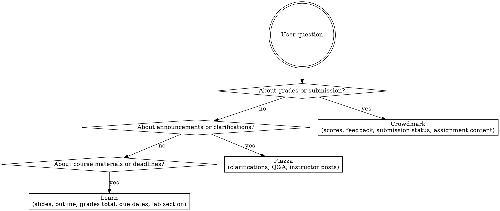

# UWaterloo Course Platform Guide

## Platform Roles

### Learn (learn.uwaterloo.ca)
The official course hub — authoritative source for:
- **Course materials**: lecture slides, notes, readings, lab manuals uploaded by the instructor
- **Assignments**: instructions, rubrics, dropboxes for submission, due dates
- **Grades**: released scores for all assessments (gradebook)
- **Announcements**: official instructor/TA news for the course
- **Lab section**: enrolled section information (LAB/LEC/TUT)
- **Course outline / syllabus**

If the user needs anything the instructor officially distributed — start with Learn.

### Piazza (piazza.com)
The course Q&A and discussion hub:
- **Instructor announcements and clarifications** — profs post logistical updates, errata, hints here (often faster than Learn announcements)
- **Student questions answered by instructors or TAs**
- **Peer discussion**: classmates discussing assignments, labs, concepts
- **Pinned notes**: high-priority instructor messages (exam logistics, deadline extensions)

Piazza is the best place for: "did the prof say anything about X?", "is there a clarification on the assignment?", "are people asking about the lab?"

### Crowdmark (app.crowdmark.com)
The grading and submission platform:
- **Assignment submission**: students upload PDFs or handwritten work here (not Learn Dropbox for most written assessments)
- **Submitted assignment content**: the actual questions/prompts are posted here when the assignment opens
- **Grades and feedback**: after grading, scores per question and marker comments appear here
- **Submission confirmation**: whether your work was received and the timestamp

Crowdmark is where you go for: "what does assignment X ask?", "did my submission go through?", "what score did I get on each question?", "what did the marker write?"

---

## Routing Quick Reference

| What the user wants | Go to |
|---------------------|-------|
| Download lecture slides / course notes | **Learn** → Content |
| See assignment instructions / rubric | **Learn** or **Crowdmark** (check both — some courses post on Crowdmark only) |
| Submit an assignment | **Crowdmark** (written work) or **Learn Dropbox** (check assignment instructions) |
| Confirm submission was received | **Crowdmark** (submission status page) |
| Check due dates | **Learn** (calendar / dropbox list) |
| See released grades | **Crowdmark** (per-question scores + feedback) or **Learn** (gradebook total) |
| See marker comments on a graded paper | **Crowdmark** |
| Find a prof/TA clarification or announcement | **Piazza** first, then **Learn Announcements** |
| Ask a question about an assignment or concept | **Piazza** |
| Find lab section or lecture section number | **Learn** |
| Find course outline / syllabus | **Learn** |

---

## Decision Flow

---

## How to Use This Guide

Before invoking any waterloo-course-tools skill, use this guide to decide which platform holds the answer:

1. Read the user's question.
2. Consult the routing table above.
3. Invoke the matching skill:
   - Learn materials/grades/section → `uwaterloo-learn-download`, `learn-grades`, `learn-lab-section`
   - Piazza posts/announcements → `waterloo-piazza-fetch`
   - Crowdmark grades/submissions/content → `crowdmark-fetch`
   - Due dates from local files → `learn-due-calendar`

When the answer could be on multiple platforms, check them in this order: **Crowdmark → Learn → Piazza** for grade/submission questions; **Piazza → Learn** for announcement/clarification questions.

---

## Common Mistakes

| Mistake | Fix |
|---------|-----|
| Looking for grades only on Learn | Crowdmark has per-question scores and marker feedback; Learn may only show a total |
| Looking for assignment content only on Learn | Many courses post assignment PDFs on Crowdmark when the assessment opens |
| Looking for submission confirmation on Learn Dropbox | Most written assessments submit through Crowdmark, not Learn |
| Treating Piazza as optional | If the course uses Piazza, instructor clarifications there are often more current than Learn announcements |
| Checking Learn for marker comments | Marker annotations and per-question feedback are on Crowdmark, not Learn |
